# SecureShare: End-to-End Encrypted File Transfer Platform

SecureShare is a production-style MVP for a secure document exchange platform. It enables registered users to transfer confidential documents (e.g., IDs, contracts, salary slips) using **Zero-Knowledge Hybrid Encryption**. Plaintext files are never stored on the server, and the database holds only encrypted metadata and cryptographic payloads.

---

## 🔐 Security & Cryptographic Architecture

SecureShare implements a robust, industry-standard hybrid encryption system combining asymmetric cryptography (RSA) and symmetric cryptography (AES-GCM).

```mermaid
flowchart TD
    subgraph Registration
        A[User Registers] --> B[Generate RSA-2048 Key Pair]
        B --> C[Derive Key from Password using PBKDF2]
        C --> D[Encrypt Private Key with AES-256-GCM]
        D --> E[Save Encrypted Private Key & Public Key in DB]
    end

    subgraph File Sending Pipeline
        F[Sender Uploads File] --> G[Fetch Recipient's Public Key]
        G --> H[Generate Random AES-256 File Key]
        H --> I[Encrypt File Payload using AES-256-GCM]
        H --> J[Wrap AES Key using Recipient RSA Public Key]
        I --> K[Save Encrypted Blob to Storage Disk]
        J --> L[Store Encrypted AES Key + IV in SQLite]
    end

    subgraph File Receiving Pipeline
        M[Recipient Authenticates] --> N[Decrypt RSA Private Key using Password KDF]
        N --> O[Load Encrypted AES File Key from DB]
        O --> P[Unwrap AES Key using Recipient RSA Private Key]
        P --> Q[Decrypt Storage Blob using AES-256-GCM]
        Q --> R[Stream Decrypted File to Browser]
    end
```



### 1. Identity & Key Management
- **Registration**: On registration, a 2048-bit RSA key pair is generated.
  - The **Public Key** is stored in the database in plaintext PEM format.
  - The **Private Key** is serialized and encrypted in-memory using **AES-256-GCM** before database storage.
  - **Key Derivation**: The key used to encrypt the private key is derived from the user's password using **PBKDF2HMAC** with a random 16-byte salt, SHA-256 hashing, and 100,000 iterations.
- **Login & Memory Safety**: Upon login, the password is used to verify the bcrypt hash *and* decrypt the user's RSA private key. The decrypted private key object is held exclusively in Streamlit's in-memory `st.session_state` cache. It is never persisted, logged, or cached to disk, and is discarded on logout.

### 2. File Transfer Cryptographic Pipeline
- **Encryption (Upload)**:
  1. Sender queries the recipient's SecureShare ID and retrieves their RSA Public Key.
  2. A cryptographically secure random 256-bit AES key is generated.
  3. The file payload is encrypted using **AES-256-GCM** with a random 12-byte IV (nonce).
  4. The AES key is wrapped (encrypted) with the recipient's RSA public key using **OAEP padding (with SHA-256)**.
  5. The ciphertext is saved to disk, while the wrapped AES key and GCM IV are stored as Base64 strings in the SQLite database.
- **Decryption (Download)**:
  1. Recipient loads the file metadata.
  2. The recipient's RSA private key (retrieved from session memory) is used to decrypt/unwrap the AES key.
  3. The ciphertext blob is loaded from disk and decrypted with the unwrapped AES key and GCM IV using AES-256-GCM.
  4. The decrypted plaintext bytes are streamed directly to the browser for download.

### 3. Forward Secrecy & Policy Enforcement
- **One-Time Downloads**: If enabled, the encrypted file blob on the server disk is securely deleted (`os.remove`) immediately after the first successful decryption.
- **Access Expiration**: Files can have an optional expiration date. When checked dynamically (during inbox load or download attempt), if the current time exceeds the expiration time, the file is marked as `EXPIRED` in the database, and the encrypted payload is deleted from disk.
- **Revocation**: The sender can revoke a file at any time. When revoked, the database records the status change, and the file's ciphertext blob is immediately deleted from disk.

---

## 📁 Project Folder Structure

```
SecureShare/
├── .streamlit/
│   └── config.toml             # Custom theme configurations (indigo/slate dark mode)
├── core/
│   ├── __init__.py             # Makes core a python package
│   ├── auth.py                 # Registration, login, and bcrypt verification
│   ├── audit_service.py        # Cryptographic and transactional event logging
│   ├── crypto_service.py       # AES-GCM and RSA-OAEP hybrid encryption operations
│   ├── db.py                   # SQLite database connections and schema setup
│   ├── file_service.py         # Encrypted uploads, downloads, revocation, and contacts
│   ├── key_manager.py          # PBKDF2 derivation, RSA key generation, and private key wraps
│   └── utils.py                # Regex validations, ID generators, and unit formatters
├── database/
│   └── secureshare.db          # SQLite Database (generated on startup)
├── storage/
│   ├── encrypted_files/        # Directory storing randomized .encbin files
│   └── temp/                   # Temporary execution folder
├── scratch/
│   └── test_crypto_flow.py     # Automated end-to-end cryptographic test harness
├── app.py                      # Main Streamlit web application & routing
├── requirements.txt            # Project dependencies
└── README.md                   # System design and walkthrough documentation
```

---

## 📊 Database Schema

SQLite schema includes three main tables:

### `users`
Tracks identity keys and credentials.
- `id` (INTEGER, Primary Key)
- `secure_id` (TEXT, Unique) - Human-readable unique ID (e.g. `SS-R564XOO0`)
- `name` (TEXT)
- `email` (TEXT, Unique)
- `password_hash` (TEXT) - Hashed using bcrypt
- `public_key_pem` (TEXT) - RSA public key
- `encrypted_private_key_pem` (TEXT) - Base64 encoded encrypted private key (nonce + ciphertext)
- `private_key_salt` (TEXT) - Base64 encoded KDF salt
- `created_at` (TIMESTAMP)

### `files`
Stores encrypted file transfer state.
- `id` (INTEGER, Primary Key)
- `file_uid` (TEXT, Unique) - UUID for the transaction
- `sender_id` (INTEGER, Foreign Key)
- `recipient_id` (INTEGER, Foreign Key)
- `original_filename` (TEXT)
- `stored_filename` (TEXT) - Randomized name on storage (e.g., `uuid.encbin`)
- `mime_type` (TEXT)
- `size_bytes` (INTEGER)
- `ciphertext_path` (TEXT)
- `encrypted_file_key` (TEXT) - Base64 encoded RSA-wrapped AES key
- `nonce` (TEXT) - Base64 encoded AES-GCM IV
- `upload_time` (TIMESTAMP)
- `status` (TEXT) - `ACTIVE`, `REVOKED`, `DOWNLOADED`, `EXPIRED`
- `expires_at` (TIMESTAMP, Nullable)
- `one_time_only` (BOOLEAN)
- `downloaded_at` (TIMESTAMP, Nullable)

### `file_events`
Ledger of all transfers and security violations.
- `id` (INTEGER, Primary Key)
- `file_id` (INTEGER, Foreign Key)
- `user_id` (INTEGER, Foreign Key) - Actor ID
- `event_type` (TEXT) - `SENT`, `DOWNLOADED`, `REVOKED`, `FAILED_DECRYPT`, `EXPIRED`
- `event_time` (TIMESTAMP)
- `details` (TEXT)

### `contacts`
Stores user-managed directories.
- `id` (INTEGER, Primary Key)
- `user_id` (INTEGER, Foreign Key)
- `contact_user_id` (INTEGER, Foreign Key)

---

## 🚀 Setting Up & Running Locally

Follow these steps to run SecureShare on your local machine:

### 1. Set Up Virtual Environment & Dependencies
Ensure Python 3.11+ is installed. In your terminal, navigate to the project directory and run:

```bash
# Create virtual environment
py -m venv venv

# Activate virtual environment
# Windows PowerShell:
.\venv\Scripts\Activate.ps1
# Windows CMD:
.\venv\Scripts\activate.bat
# Linux/macOS:
source venv/bin/activate

# Install required packages (Streamlit, Cryptography, bcrypt, pandas)
pip install -r requirements.txt --no-cache-dir
```

### 2. Run Automated Verification Tests
Run the standalone test harness to verify key generation, hybrid encryption, inbox routing, and log audits:

```bash
python scratch/test_crypto_flow.py
```
*Expected Output*:
```text
=== STARTING SECURESHARE SYSTEM VERIFICATION ===
[+] Database tables initialized.
--- Testing User Registration ---
[+] Alice registered. Secure ID: SS-R564XOO0
[+] Bob registered. Secure ID: SS-HXJHFA9V
...
[SUCCESS] ALL CRYPTOGRAPHIC AND FLOW TESTS PASSED [SUCCESS]
```

### 3. Launch the Streamlit Web Application
Start the Streamlit dev server to run the user interface:

```bash
streamlit run app.py
```
The browser will automatically load the app at `http://localhost:8501`.

---

## 🧪 Quick Sandbox Flow

1. Open `http://localhost:8501`.
2. Go to the **Register** tab:
   - Create a user named **Alice** (`alice@test.com`, password: `Password123!`). Take note of her generated SecureShare ID (e.g. `SS-R564XOO0`).
   - Create a second user named **Bob** (`bob@test.com`, password: `Password123!`). Take note of his ID.
3. Log in as **Alice**:
   - Go to the **Contacts** tab, search for Bob's email or ID, and click **Add**.
   - Go to the **Send File** tab, choose Bob from Contacts (or enter his ID manually), upload a test file, select **One-time Download**, and click **Encrypt and Dispatch File**.
   - Go to **Sent Files** to verify the status is `ACTIVE` and delivery details show `Not yet downloaded`.
   - Logout Alice.
4. Log in as **Bob**:
   - Go to the **Inbox** tab.
   - You will see the file sent by Alice. Click **Decrypt & Download**.
   - Input your password if prompted or wait for the system to decrypt. Click the download button to save the file.
   - Refresh the page: the file status changes to `DOWNLOADED` and can no longer be decrypted (the encrypted storage blob has been scrubbed from disk).
5. Check the **Audit Logs** to view the timeline: registration, file dispatched, and successful decryption.
